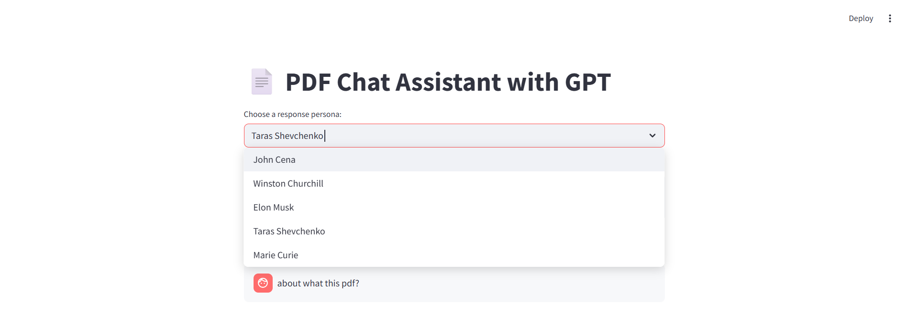
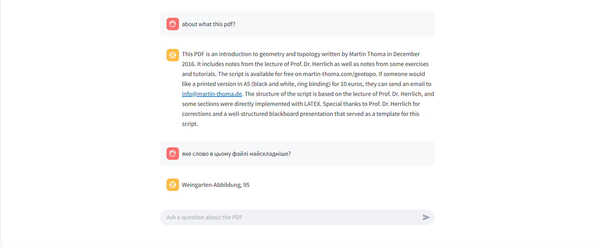

# 🧠 PDF Chat Assistant with GPT

PDF Chat Assistant is a Streamlit-based application that allows users to upload any PDF file and interact with its contents using GPT (OpenAI API).  
You can ask questions in any language, and receive answers in the same language — in the style of a chosen persona like John Cena, Winston Churchill, or Taras Shevchenko.

---

## 📸 Screenshots

  



---

## 🚀 Features

- 📄 Upload any PDF document (up to 200MB)
- 🤖 Ask questions about the content
- 🌍 Multilingual support
- 🎭 Choose a response persona for custom style
- ✅ Unit-tested with pytest
- ⚡ Powered by Langchain, OpenAI, and PyMuPDF

---

## 🛠️ Tech Stack

- Python
- Streamlit
- Langchain
- OpenAI API
- PyMuPDF (fitz)
- Chroma (vector store)
- Pytest (for unit testing)

---

## 📦 Installation

```bash
git clone https://github.com/stasmerezhaniy/pdf-gpt-chat-assistant.git
cd pdf-gpt-chat-assistant
pip install -r requirements.txt
```

---

## 🔑 API Key

Create a file called `api_key.py` in the project root:

```python
API_KEY = "your-openai-api-key"
```

---

## ▶️ Run Locally

```bash
streamlit run app.py
```

---

## 🧪 Run Tests

```bash
pytest tests/
```

---

## 📁 Folder Structure

```
├── app.py
├── utils/
│   ├── pdf_reader.py
│   ├── text_splitter.py
│   ├── chat_engine.py
│   └── prompt_templates.py
├── tests/
│   └── test_*.py
├── requirements.txt
└── README.md
```

---

## 📝 License

MIT — feel free to use and modify.

---
